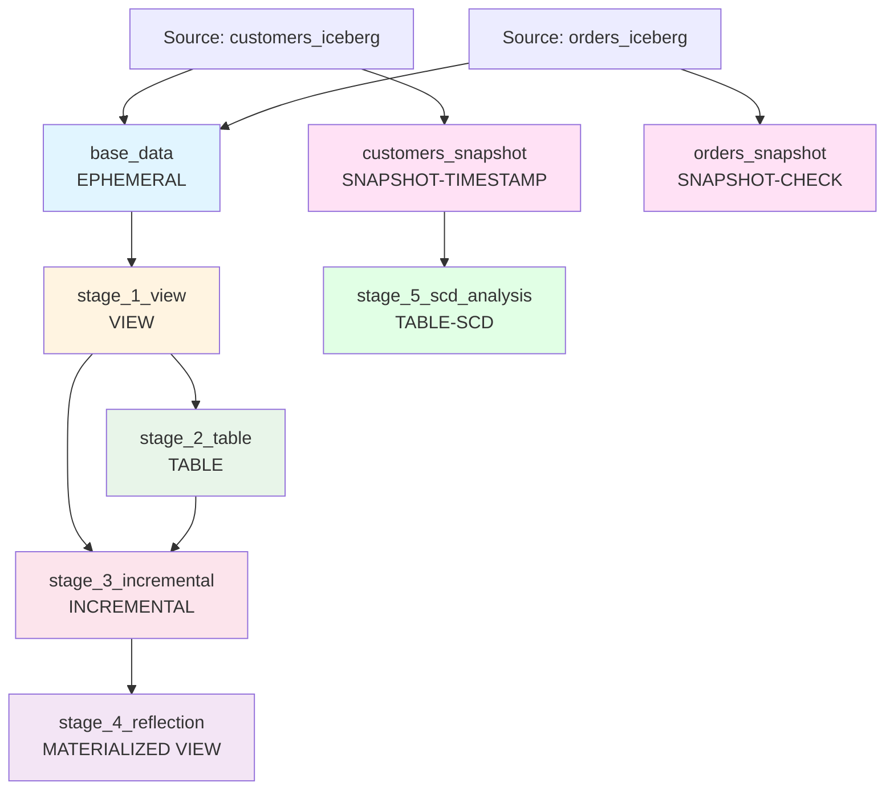

# dbt Presentation Project - Dremio 26

A comprehensive dbt project demonstrating **all materialization types** supported by Dremio 26 with Apache Iceberg, featuring dependency flow, partition filtering with environment variables, and best practices.

---

## 🎯 Presentation Overview

This project showcases:

✅ **All Dremio 26 Materializations**: ephemeral, view, table, incremental, materialized view  
✅ **Snapshots (SCD Type 2)**: Timestamp and check strategies for slowly changing dimensions  
✅ **dbt Expectations Tests**: Comprehensive data quality testing with Great Expectations  
✅ **Dependency Flow**: Clear lineage from source to final aggregations  
✅ **Partition Macro**: Dynamic partition filtering using environment variables  
✅ **Iceberg Features**: Partitioning, ACID compliance, incremental refresh  
✅ **Sample Data**: Complete DDL/DML scripts for hands-on demonstration

---

## 📊 Materialization Types Demonstrated

### 1. **Ephemeral** (`base_data`)
- **What**: CTE-based model, not persisted in Dremio
- **When**: Lightweight transformations, intermediate calculations
- **Pros**: No storage overhead, reduces warehouse clutter
- **Cons**: Recomputed each time referenced

### 2. **View** (`stage_1_view`)
- **What**: Logical view, no physical storage
- **When**: Frequently changing data, simple transformations
- **Pros**: Always current, minimal storage
- **Cons**: Slower query performance than materialized options

### 3. **Table** (`stage_2_table`)
- **What**: Physical Iceberg table, full refresh each run
- **When**: Aggregated data, stable datasets
- **Pros**: Fast query performance, ACID compliance
- **Cons**: Full refresh can be expensive for large datasets

### 4. **Incremental** (`stage_3_incremental`)
- **What**: Iceberg table with incremental updates
- **When**: Large fact tables, event/log data, time-series
- **Pros**: Efficient updates, partition pruning, merge/append strategies
- **Cons**: More complex logic, requires unique key

### 5. **Materialized View** (`stage_4_reflection`)
- **What**: Dremio Reflection with auto-refresh
- **When**: Dashboard queries, BI acceleration
- **Pros**: Query rewrite optimization, automatic refresh
- **Cons**: Dremio-specific feature

### 6. **Snapshots** (`customers_snapshot`, `orders_snapshot`)
- **What**: SCD Type 2 for tracking historical changes
- **When**: Slowly changing dimensions, audit trails, temporal analysis
- **Strategies**: 
  - **Timestamp**: Uses updated_at column for change detection
  - **Check**: Compares specific columns to detect changes
- **Pros**: Historical data preservation, point-in-time queries
- **Cons**: Storage overhead for historical versions

---

## 🔄 Dependency Flow



---

## 🚀 Getting Started

### Prerequisites

- Dremio 26+ instance
- dbt-dremio adapter (1.10.0+)
- Nessie catalog configured
- Python 3.8+

### Step 1: Prepare Source Data

```bash
# Navigate to setup directory
cd setup/

# Follow instructions in setup/README.md to:
# 1. Run 01_create_source_tables.sql (DDL)
# 2. Run 02_insert_sample_data.sql (DML)
# 3. Verify data is loaded
```

### Step 2: Configure dbt Profile

Ensure your `~/.dbt/profiles.yml` is configured for Dremio:

```yaml
dlh_demo:
  target: dev
  outputs:
    dev:
      type: dremio
      host: your-dremio-host
      port: 9047
      user: your-username
      password: your-password
      dremio_space: nessie
      dremio_space_folder: warehouse
```

### Step 3: Install Dependencies

```bash
dbt deps
```

### Step 4: Run the Presentation Models

```bash
# Run all presentation models
dbt run --select presentation

# Or run individually to demonstrate each materialization
dbt run --select base_data           # Ephemeral
dbt run --select stage_1_view        # View
dbt run --select stage_2_table       # Table
dbt run --select stage_3_incremental # Incremental
dbt run --select stage_4_reflection  # Materialized View
```

---

## 🎛️ Using the Partition Macro

The `get_partition_filter` macro enables dynamic partition filtering using environment variables.

### Basic Usage

```bash
# Set partition date via environment variable
export DBT_PARTITION_DATE='2024-01-02'

# Run incremental model with partition filter
dbt run --select stage_3_incremental
```

### Full Refresh

```bash
# Rebuild entire incremental table
dbt run --select stage_3_incremental --full-refresh
```

### Custom Date Range

```bash
# Process last 3 days (if env var not set, uses default_days_back)
dbt run --select stage_3_incremental
```

### Macro Parameters

```jinja
{# In your model #}
{{ get_partition_filter(
    partition_column='order_date',      # Column to filter
    env_var='DBT_PARTITION_DATE',       # Environment variable name
    default_days_back=7                 # Default lookback if env var not set
) }}
```

---

## � Working with Snapshots (SCD Type 2)

Snapshots track slowly changing dimensions by creating new versions of records when changes occur.

### Running Snapshots

```bash
# Run all snapshots
dbt snapshot

# Run specific snapshot
dbt snapshot --select customers_snapshot
dbt snapshot --select orders_snapshot
```

### Snapshot Strategies

**Timestamp Strategy** (`customers_snapshot`):
- Uses `updated_at` column to detect changes
- More efficient for tables with timestamp columns
- Automatically tracks when records change

**Check Strategy** (`orders_snapshot`):
- Compares specific columns (`order_status`, `amount`)
- Flexible when timestamp column unavailable
- Detects changes by comparing column values

### Querying Snapshot Data

```sql
-- Get current version of all customers
SELECT * FROM snapshots.customers_snapshot
WHERE dbt_valid_to IS NULL;

-- Get historical versions
SELECT 
    customer_id,
    name,
    customer_segment,
    dbt_valid_from,
    dbt_valid_to
FROM snapshots.customers_snapshot
WHERE customer_id = 1
ORDER BY dbt_valid_from;

-- Point-in-time query (customers as of specific date)
SELECT * FROM snapshots.customers_snapshot
WHERE dbt_valid_from <= '2024-01-15'
  AND (dbt_valid_to > '2024-01-15' OR dbt_valid_to IS NULL);
```

### SCD Analysis Model

The `stage_5_scd_analysis` model demonstrates how to analyze snapshot data:

```bash
dbt run --select stage_5_scd_analysis
```

---

## 🧪 dbt Expectations Tests

This project uses **dbt_expectations** package for advanced data quality testing based on Great Expectations.

### Test Categories

**Column Value Tests:**
- `expect_column_values_to_be_in_set` - Validate categorical values
- `expect_column_values_to_be_between` - Range validation
- `expect_column_values_to_not_be_null` - Null checks
- `expect_column_values_to_be_of_type` - Data type validation

**Table-Level Tests:**
- `expect_table_row_count_to_be_between` - Row count validation

### Running Tests

```bash
# Run all tests
dbt test

# Run only dbt_expectations tests
dbt test --select tag:great_expectations

# Run tests for specific model
dbt test --select stage_2_table

# Run data quality tests
dbt test --select tag:data_quality
```

### Example Tests in Schema

```yaml
columns:
  - name: customer_tier
    tests:
      - dbt_expectations.expect_column_values_to_be_in_set:
          value_set: ['VIP', 'Regular', 'New']
          tags: ['data_quality', 'great_expectations']
  
  - name: total_revenue
    tests:
      - dbt_expectations.expect_column_values_to_be_between:
          min_value: 0
          max_value: 100000
          tags: ['data_quality', 'great_expectations']
```

---

## �📈 Presentation Flow

### Demo Script

1. **Show Source Data**
   ```sql
   SELECT * FROM nessie.customers_iceberg LIMIT 10;
   SELECT * FROM nessie.orders_iceberg LIMIT 10;
   ```

2. **Explain Ephemeral Model**
   - Open `models/presentation/base_data.sql`
   - Show that it's not in Dremio (only exists as CTE)
   - Run: `dbt run --select base_data`

3. **Demonstrate View**
   - Open `models/presentation/stage_1_view.sql`
   - Show in Dremio UI (no physical storage)
   - Run: `dbt run --select stage_1_view`

4. **Show Table Materialization**
   - Open `models/presentation/stage_2_table.sql`
   - Check Iceberg format in Dremio
   - Run: `dbt run --select stage_2_table`

5. **Incremental with Partitions**
   - Open `models/presentation/stage_3_incremental.sql`
   - Explain partition macro
   - Demo with env var:
     ```bash
     export DBT_PARTITION_DATE='2024-01-03'
     dbt run --select stage_3_incremental
     ```

6. **Materialized View (Reflection)**
   - Open `models/presentation/stage_4_reflection.sql`
   - Show aggregated KPIs
   - Run: `dbt run --select stage_4_reflection`

7. **View Dependency Graph**
   ```bash
   dbt docs generate
   dbt docs serve
   ```

8. **Demonstrate Snapshots (SCD Type 2)**
   - Explain snapshot concept
   - Run snapshots:
     ```bash
     dbt snapshot
     ```
   - Show snapshot data in Dremio:
     ```sql
     -- Current customer versions
     SELECT * FROM snapshots.customers_snapshot WHERE dbt_valid_to IS NULL;
     
     -- Historical changes
     SELECT customer_id, name, customer_segment, dbt_valid_from, dbt_valid_to
     FROM snapshots.customers_snapshot
     ORDER BY customer_id, dbt_valid_from;
     ```
   - Run SCD analysis model:
     ```bash
     dbt run --select stage_5_scd_analysis
     ```

9. **Run dbt Expectations Tests**
   - Explain data quality testing
   - Run all tests:
     ```bash
     dbt test
     ```
   - Run specific test categories:
     ```bash
     # Only Great Expectations tests
     dbt test --select tag:great_expectations
     
     # Data quality tests
     dbt test --select tag:data_quality
     ```
   - Show test results and explain failures (if any)

10. **Final Walkthrough**
    - Review all materializations created
    - Show complete dependency graph
    - Highlight key learnings

---

## 🧪 Testing

```bash
# Run all tests
dbt test --select presentation

# Test specific models
dbt test --select stage_2_table
dbt test --select stage_3_incremental
```

---

## 📁 Project Structure

```
dlh_demo/
├── setup/                          # Data preparation scripts
│   ├── 01_create_source_tables.sql # DDL for Iceberg tables
│   ├── 02_insert_sample_data.sql   # DML for sample data
│   └── README.md                   # Setup instructions
├── macros/
│   └── get_partition_filter.sql    # Partition filtering macro
├── snapshots/                      # SCD Type 2 snapshots
│   ├── customers_snapshot.sql      # Timestamp strategy
│   ├── orders_snapshot.sql         # Check strategy
│   └── schema.yml                  # Snapshot documentation
├── models/
│   ├── presentation/               # Presentation models
│   │   ├── base_data.sql          # Ephemeral
│   │   ├── stage_1_view.sql       # View
│   │   ├── stage_2_table.sql      # Table
│   │   ├── stage_3_incremental.sql # Incremental
│   │   ├── stage_4_reflection.sql  # Materialized View
│   │   ├── stage_5_scd_analysis.sql # SCD Analysis
│   │   └── schema.yml             # Documentation + dbt_expectations tests
│   └── ...                        # Other models
└── README.md                      # This file
```

---

## 🔍 Key Concepts Explained

### Iceberg Partitioning

All Dremio 26 tables use Apache Iceberg format:
- **ACID compliance**: Atomic, consistent, isolated, durable operations
- **Time travel**: Query historical data snapshots
- **Schema evolution**: Add/modify columns without rewriting data
- **Partition pruning**: Efficient queries with partition filtering

### Incremental Strategies

**Append**: Add new records only
```sql
{{ config(incremental_strategy='append') }}
```

**Merge**: Update existing + add new (requires unique_key)
```sql
{{ config(
    incremental_strategy='merge',
    unique_key='order_id'
) }}
```

### Dremio Reflections

Materialized views in Dremio:
- Automatically refresh based on policy
- Query rewrite optimization (transparent to users)
- Support incremental refresh for Iceberg sources

---

## 📚 Resources

- [dbt Documentation](https://docs.getdbt.com/)
- [Dremio Documentation](https://docs.dremio.com/)
- [dbt-dremio Adapter](https://github.com/dremio/dbt-dremio)
- [Apache Iceberg](https://iceberg.apache.org/)

---

## 🤝 Contributing

This is a presentation/demo project. Feel free to adapt for your own use cases!

---

**Happy Presenting! 🎉**

